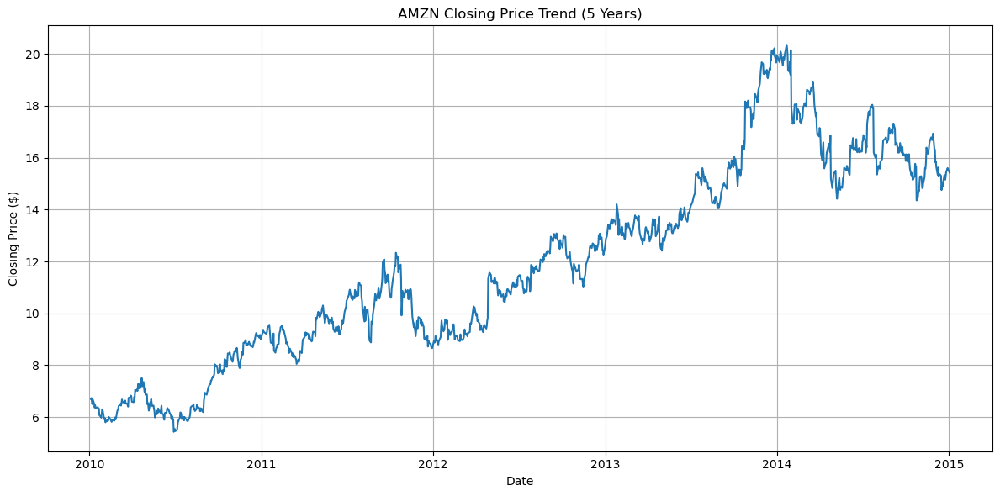
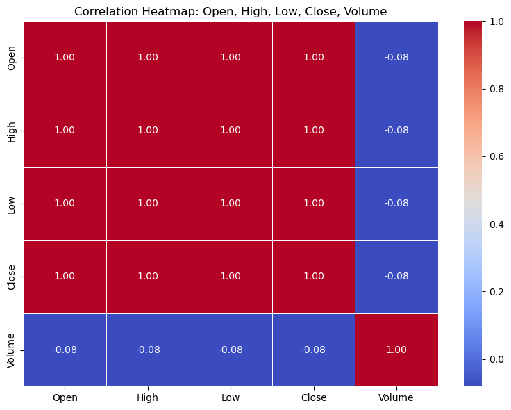
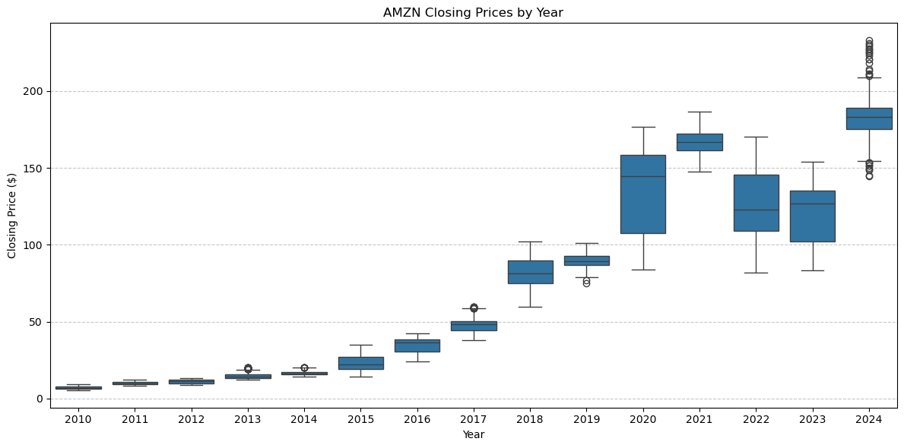

# 📈 S&P 500 Stock Market Analysis Using Python

## 📌 Overview
An end-to-end exploratory data analysis of the S&P 500 stock market dataset covering 500+ stocks over 5 years. This project answers key business questions around stock performance, trading volume, price trends, and market behaviour using Python's core data analytics libraries.

---

## 🗂️ Dataset
**Source:** [Kaggle — S&P 500 Stocks](https://www.kaggle.com/datasets/andrewmvd/sp-500-stocks)

| File | Description |
|---|---|
| `sp500_stocks.csv` | Daily OHLCV data for 500+ stocks over 5 years |

**Key Columns:**
`Date`, `Open`, `High`, `Low`, `Close`, `Volume`, `Symbol`

---

## 🛠️ Tools & Libraries

| Library | Purpose |
|---|---|
| **Pandas** | Data loading, cleaning, and analysis |
| **NumPy** | Numerical operations and array handling |
| **Matplotlib** | Line charts, bar charts, and subplots |
| **Seaborn** | Heatmaps and boxplots |
| **Jupyter Notebook** | Interactive development environment |

---

## 🧹 Data Cleaning Steps

- Loaded dataset using `pd.read_csv()` and inspected shape and data types
- Converted `Date` column from string to datetime using `pd.to_datetime()`
- Checked and dropped null values in `Close` and `Volume` columns
- Removed duplicate rows
- Sorted by `Symbol` and `Date`, reset index
- Checked for anomalies using `.describe()`
- Extracted `Year`, `Month`, and `Quarter` as new columns from `Date`

---

## ❓ Analysis Questions & Key Findings

### 🐼 Pandas Analysis

| # | Question | Key Finding |
|---|---|---|
| Q1 | How many unique stock symbols are in the dataset? | 500+ unique symbols |
| Q2 | What is the full date range of the dataset? | Multi-year range confirmed |
| Q3 | Which 10 stocks have the highest average closing price? | High-value stocks identified |
| Q4 | How many trading days are recorded per stock symbol? | Consistent coverage across symbols |
| Q5 | Which stock had the highest single-day price range (High - Low)? | Extreme intraday volatility found |
| Q6 | What is the monthly average closing price for AMZN, MSFT, GOOG? | Month-wise trends extracted |
| Q7 | How many stocks crossed $1000 closing price at any point? | Small number of high-value stocks |
| Q8 | What is the total trading volume per year? | Volume trends identified by year |
| Q9 | Which quarter consistently has the highest average returns? | Seasonal return patterns observed |
| Q10 | Top 3 best performing stocks per year by average close price | Year-wise leaders identified |

---

## 📊 Visualizations

### 1. AMZN Closing Price Trend (5 Years)


### 2. Total Trading Volume per Year (Annotated Bar Chart)
1[Total Trading Volume per Year](Images/volume_by_year.png)

### 3. Correlation Heatmap — OHLCV Columns


### 4. AMZN Closing Prices Boxplot by Year


---

## 💡 Key Insights

- **Open, High, Low, and Close** prices are very highly correlated (near 1.0), while **Volume** shows low correlation with price columns
- **AMZN** showed significant price growth over the 5-year period with notable volatility spikes
- Only a **small number of stocks** ever crossed the $1000 closing price mark
- Trading volume shows **year-on-year variation**, with certain years seeing significantly higher activity
- **Quarterly return patterns** reveal seasonal trends in market performance

---

## 📁 Project Structure

```
SP500_Stock_Analysis/
│
├── data/
│   └── sp500_stocks.csv
├── notebooks/
│   └── stock_analysis.ipynb
├── Images/
│   ├── amzn_closing_trend.png
│   ├── volume_by_year.png
│   ├── correlation_heatmap.png
│   └── amzn_boxplot_by_year.png
└── README.md
```


## 👤 Author

**G Anil Kumar**
- 🔗 GitHub: [github.com/anilbmsce](https://github.com/anilbmsce)
- 💼 LinkedIn: [linkedin.com/in/g-anil-kumar-6740b1307](https://linkedin.com/in/g-anil-kumar-6740b1307)
